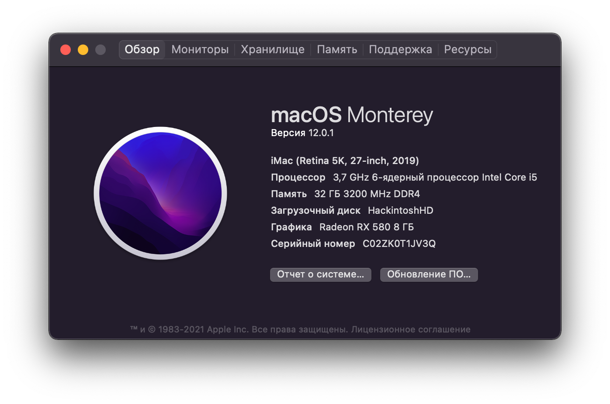
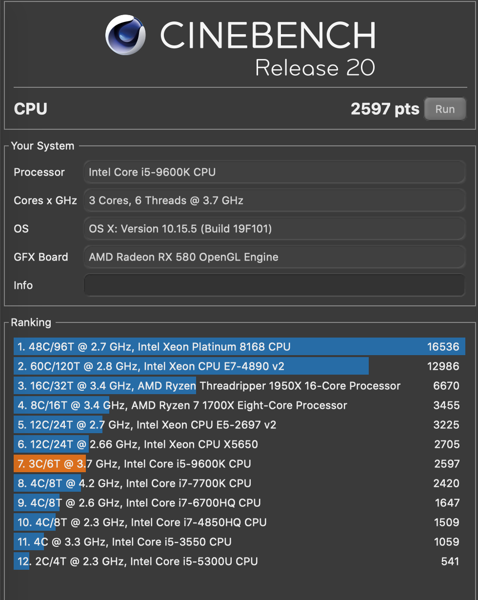
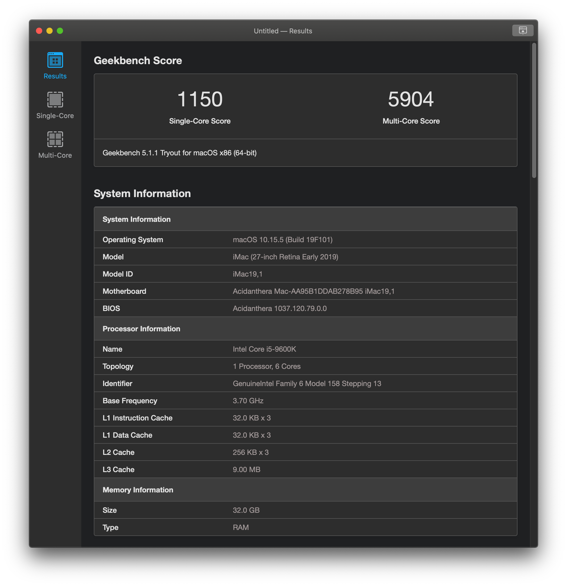

### Hackintosh for Asus ROG Strix Z390-E

__[OpenCore 0.7.4](https://github.com/acidanthera/OpenCorePkg) | MacOS Monterey 12.0.1__

### 📸 Screenshots

About

Benchmarks

### 📃 Hardware

List

* Motherboard: ASUS ROG STRIX Z390-E Gaming ATX (s-1151)
* CPU: Intel Core i5-9600K 3.7GHz/9MB (s-1151)
* GPU: Radeon RX 580 8GB DDR5 Sapphire Pulse
* RAM: Crucial Ballistic Sport LT Red  3200MHz (16x2)
* Memory: Samsung 970 EVO Plus 500GB
* WIFI/Bluetooth: [Fenvi T919](https://www.aliexpress.com/item/32778371977.html)
* Power: 650W Corsair RM650X
* CPU Cooler: Be Quite Dark Rock Pro 4
* Case: DeepCool Matrexx 55
* Monitor: LG UltraFine 27UL650-W 27’’
* Mouse: Logitech MXMaster 2S
* Keyboard: Varmilo VA108MAC
* Kingston SKC400S37 128Gb
* WD Caviar Blue WD10EZEX 1 Tb

### 🔄 Status

Details

* Bluetooth & Wi-Fi (via [Fenvi T919](https://www.aliexpress.com/item/32778371977.html))
* [M.2 slots](_resources/m2_info.png)
* Onboard Bluetooth. Try this [kext](https://github.com/zxystd/IntelBluetoothFirmware).
* [USB table](_usb_map/usb_table.md)

### ❗️ Usage

How to install

1. Fill the [SMBIOS](https://dortania.github.io/OpenCore-Desktop-Guide/post-install/iservices.html#generate-a-new-serial) section
2. Update BIOS to the latest version

3. Check BIOS settings

|Option|Flag state |
| - | - |
|Fast Boot | - |
|Secure Boot | - |
|VT-d | - |
|CSM | - |
|CFG-Lock | - |
|Serial Port | - |
|WiFi & Bluetooth | - |
|Above 4G | + |
|XHCI Hand-off | + |
|OS Type | windows |
|XMP II profile (optional)| + |

### 🛠 Tools

Helpful utilities

* [MountEFI](https://github.com/corpnewt/MountEFI) - Helps to mount /EFI folder
* [ProperTree](https://github.com/corpnewt/MountEFI) - A way to open config.plist
* [USBMap](https://github.com/corpnewt/USBMap) - Tool to make a usb map
* [GenSMBIOS](https://github.com/corpnewt/GenSMBIOS) - Apple seral generator
* [Lilu-and-Friends](https://github.com/corpnewt/Lilu-and-Friends) - To update kexts
* [OCConfigCompare](https://github.com/corpnewt/OCConfigCompare) - To update OC

### ✅ Manual update

How to manual update this build

1. Update kexts  
You can compile them with [Lilu-and-Friends](https://github.com/corpnewt/Lilu-and-Friends).  
Or download the pre-compiled ones from [kexts.goldfish64.com](kexts.goldfish64.com).

2. Update following `*.efi` files  
* `EFI/BOOT/BOOTx64.efi`
* `EFI/OC/OpenCore.efi`
* `EFI/OC/Drivers/OpenRuntime.efi`
* `EFI/OC/Drivers/OpenCanopy.efi`
* `EFI/OC/Tools/OpenShell.efi`
* Remove `EFI/OC/Resources` and replace with [this](https://github.com/acidanthera/OcBinaryData/tree/master/Resources).

3. Update Config  
* Run [OC Config Compare](https://github.com/corpnewt/OCConfigCompare) on `config.plist` and the `Docs/Sample.plist` from the release archive.
* Compare the highlighted values side by side.
* Double-check the [guide](https://dortania.github.io/OpenCore-Install-Guide/) on the differences.
* [Use Sanity Checker](https://opencore.slowgeek.com) or `ocvalidate` utility.

### 📩 Credits
by [@lbrdev](https://github.com/lbrdev)
