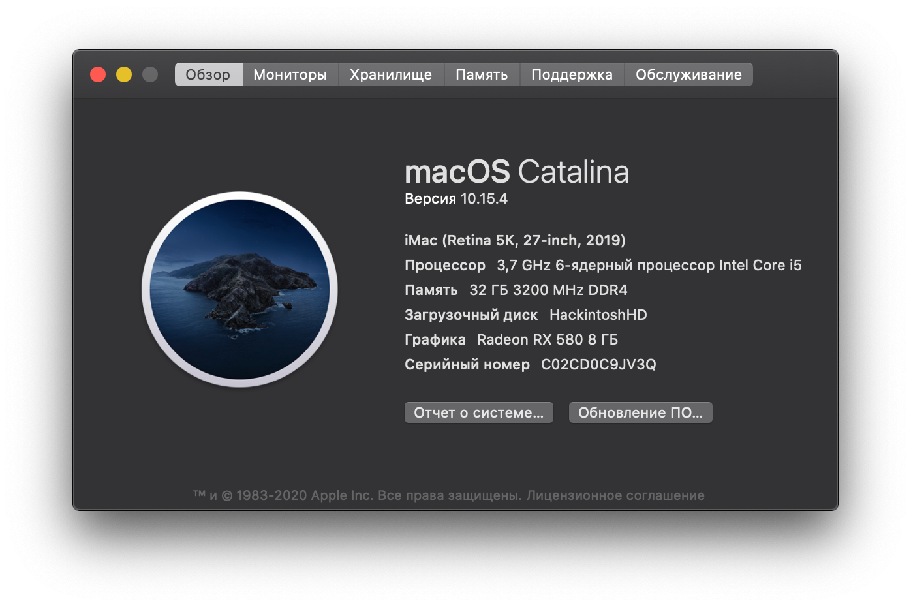

# OpenCore Hackintosh for Asus ROG Strix Z390-E/Intel i5 9600k
# Full rebuild to OpenCore 0.5.9!
__OpenCore Version: 0.5.9__ MacOS Catalina by [OpenCore Guide](https://dortania.github.io/OpenCore-Desktop-Guide/)

## 📃 Hardware List
#### 🖥 Mac
* Motherboard: ASUS ROG STRIX Z390-E Gaming ATX (s-1151)
* CPU: Intel Core i5-9600K 3.7GHz/9MB (s-1151)
* GPU: Radeon RX 580 8GB DDR5 Sapphire Pulse
* RAM: Crucial Ballistic Sport LT Red  3200MHz (16x2)
* Memory: Samsung 970 EVO Plus 500GB
* WIFI/Bluetooth: Fenvi T919
* Power: 650W Corsair RM650X
* CPU Cooler: Be Quite Dark Rock Pro 4
* Case: DeepCool Matrexx 55
* Monitor: LG UltraFine 27UL650-W 27’’
* Mouse: Logitech MXMaster 2S
* Keyboard: Varmilo VA108MAC

#### 🎮 Windows
* Kingston SKC400S37 128Gb
* WD Caviar Blue WD10EZEX 1 Tb

## 🔄 System status
✅ **Working**
* Audio
* APFS
* Sleep/Wake
* [USB](_usb_map/usb_table.md)
* App Store
* Facetime
* Bluetooth & Wi-Fi (via Fenvi T919)
* NVRAM

✳️ **Optional**
* Onboard Bluetooth. Try this [kext](https://github.com/zxystd/IntelBluetoothFirmware).

## 📸 Screenshots

Benchmarks

## ❗️❗️ Before Use
**INPORTANT!**
1. Change SMBIOS info for yours (config.plist/PlatformInfo/Generic). You can use this [guide](https://dortania.github.io/OpenCore-Desktop-Guide/post-install/iservices.html).
2. NVMe should be installed into M.2_2 slot on Asus Z390-E motherboard! Otherwise it will work in only X1 channel (~30% of full NVMe speed)!

## ⚙️ BIOS
First of all update your BIOS to the latest version.
Then follow the list:

|Option|Flag|
|-|-|
|Fast Boot | disable|
|SecureBoot | disable
|VT-d | disable
|CSM | disable
|CFG-Lock | disable
|Serial Port | disable
|WiFi & Bluetooth | disable
|Above 4G | enable
|XHCI Hand-off | enable
|OS Type | windows |
|XMP II profile (optional)| enable|

## 😇 Config Sanity
You can check my config [here](https://opencore.slowgeek.com/?file=coffeelake059Uy7glO&rs=coffeelake059).

## 🗺 USB Map
Build has a USBMap.kext.

Check [usb table](_usb_map/usb_table.md) for details.

## 🛠 Tools
Must have OpenCore hackintosher's tools
* [MountEFI](https://github.com/corpnewt/MountEFI) - Helps to mount /EFI folder
* [ProperTree](https://github.com/corpnewt/MountEFI) - A way to open config.plist
* [USBMap](https://github.com/corpnewt/USBMap) - Tool to make a usb map
* [GenSMBIOS](https://github.com/corpnewt/GenSMBIOS) - Apple seral generator
* [Lilu-and-Friends](https://github.com/corpnewt/Lilu-and-Friends) - To update kexts
* [OCConfigCompare](https://github.com/corpnewt/OCConfigCompare) - To update OC

## 📩 Contacts
My email for questions - lbrdev.contact@gmail.com
