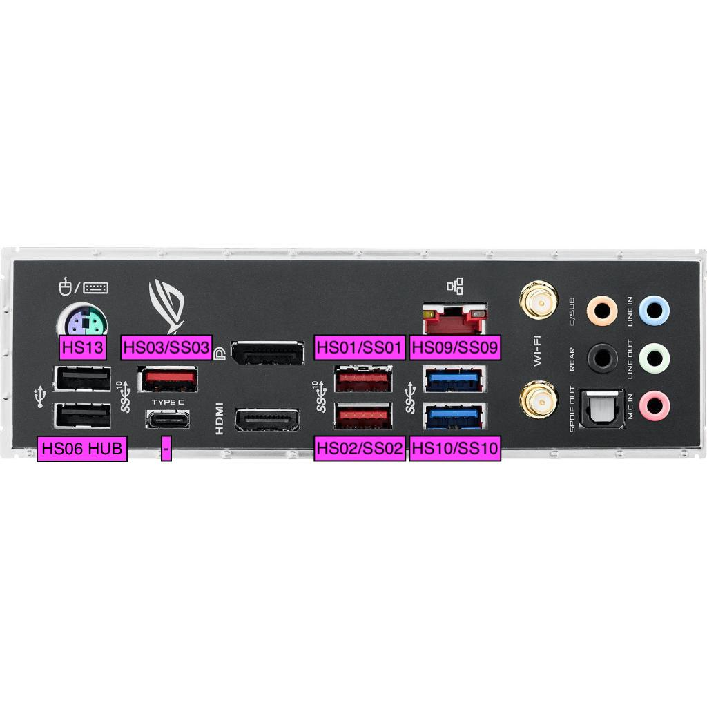
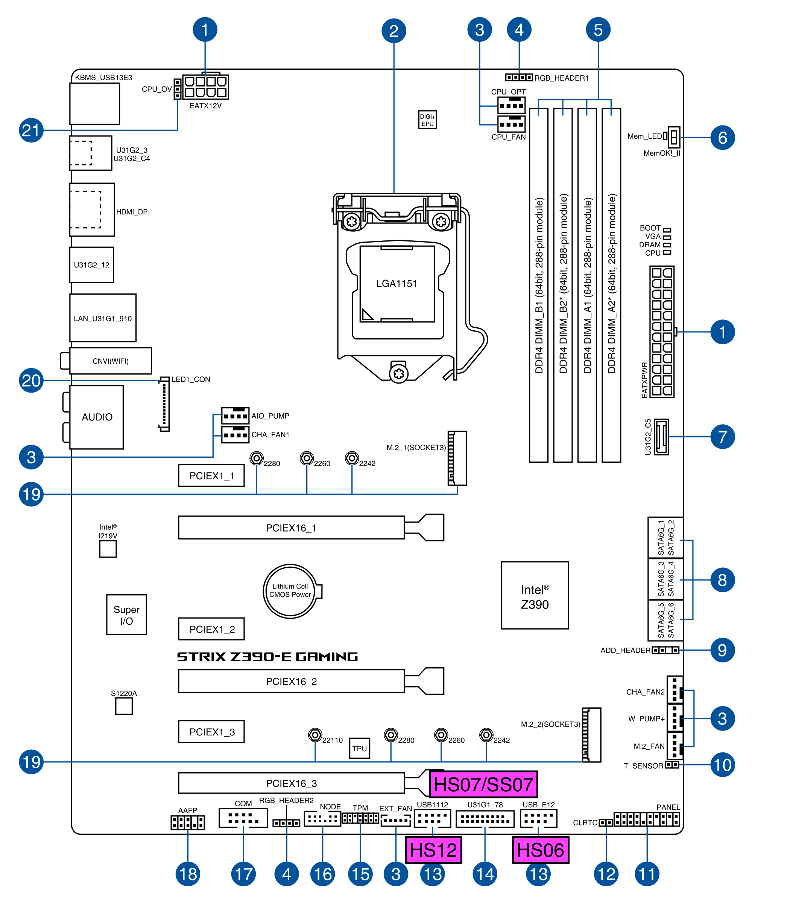

## USB Map table
| Ports count  | Enabled | Disabled manual |
|-|-|-|
| 2 | HS01/SS01 - REAR - 3.1 Gen 2|HS14 - INTEL Z390-E BT CARD HEADER|
| 2 | HS02/SS02 - REAR - 3.1 Gen 2|HS04?/SS04? - PROBABLY REAR USB-C|
| 2 | HS03/SS03 - REAR - 3.1 Gen 2||
| 2 | HS07/SS07 - FRONT/INTERNAL - 3.1 Gen 1||
| 2 | HS09/SS09 - REAR - 3.1 Gen 1||
| 2 | HS10/SS10 - REAR - 3.1 Gen 1||
| 1 | HS12 - INTERNAL - FENVI 2.0||
| 1 | HS13 - REAR - 2.0||
| 1 | HS06 - REAR/FRONT/INTERNAL HUB - 2.0||
| __RESULT: 15 active ports__ |||

## Layout

